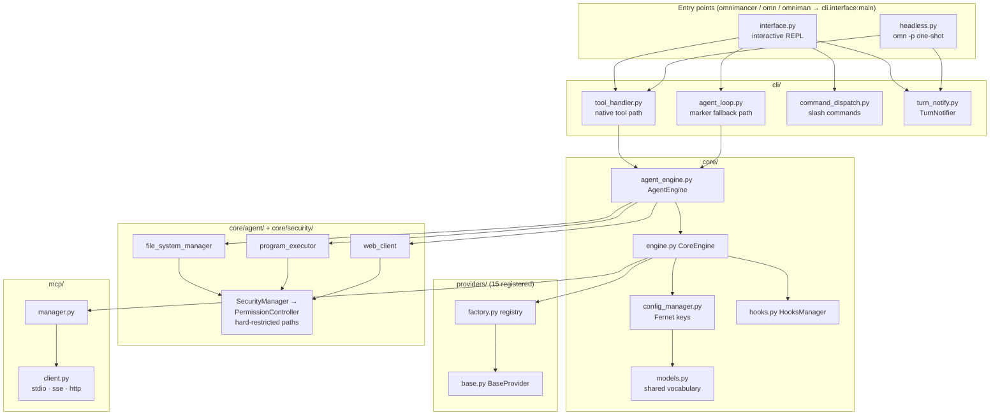

# Codebase Map

> Auto-generated by Cartographer. Last mapped: 2026-08-01T00:54:37Z (branch `feat/turn-notify`)

Omnimancer (`omnimancer-cli`) is a terminal coding agent that runs against any of 14 LLM
backends — `claude -p` without provider lock-in. Interactive REPL + headless pipeline mode,
MCP, lifecycle hooks, permission rules, subagents, a layered approval/security gate, and an
external turn-completion notification surface for orchestrators.

## System Overview



## Directory Structure

```
omnimancer/                     (~370k tokens of source)
├── core/            188.9k  44 files — engine, config, models, agent+security subsystems
│   ├── agent/        63.5k  14 files — file system, executor, web client, approvals, workflows
│   ├── security/     16.9k   7 files — SecurityManager, PermissionController, sandbox, audit
│   └── (root)                 engine.py, agent_engine.py, models.py (17.4k), config_* (22.7k)
├── cli/              86.0k  22 files — REPL, headless runner, two agent loops, slash commands
├── providers/        68.3k  19 files — BaseProvider + 15 registered backends + factory
├── mcp/               7.8k   3 files — MCP client/manager (soft dependency)
└── utils/             9.3k   4 files — error hierarchy, error handler, retry
tests/               ~250k   ~90 files — tests/cli/ + tests/core/ colocated; providers flat at root
docs/                 ~35k   mixed freshness — see Gotchas #12
factory-pipeline.yml          Factory CI (NOT GitHub Actions/GitLab — those docs are stale)
```

## Module Guide

### The two agent execution paths (the most important structural fact)

Every agent-facing change must work on both paths. The fork is
`engine.provider_supports_tools()` — but it does **different jobs** in the two runners:

| | Interactive (`cli/interface.py`) | Headless (`cli/headless.py`) |
|---|---|---|
| What the check gates | Which loop runs: native `_handle_tool_calling_flow` vs marker `_execute_continuous_workflow` | Only the system-prompt text; headless **always** uses native tool calling |
| Marker fallback | Yes (`agent_loop.py`) | **None** — markers from a non-tool provider render as literal text |
| Iteration cap | **None** (`while True`); only `RepeatedCallTracker` guards | `MAX_TOOL_ITERATIONS=25` (`--max-iterations` > `OMNIMANCER_MAX_ITERATIONS` env > default) |

- **Native path** — `cli/tool_handler.py`: `CODING_AGENT_TOOLS` (`core/agent/tool_definitions.py`)
  deliberately mirrors Claude Code's names/schemas (Read, Write, Edit, Bash, Glob, Grep,
  WebFetch). `Edit` is synthesized client-side (read → unique-match replace → write);
  `Glob`/`Grep` become real `find`/`grep -rE` shell-outs with dir pruning; empty matches
  return "No X found" text (grep exit 1 = success) so the repeat tracker doesn't kill the
  turn. `RepeatedCallTracker`: identical call runs twice, nudges at 3, aborts the turn at 5.
  Results truncated head+tail at 16k chars. `AUTO_APPROVED_TOOLS = {Read, Glob, Grep, WebFetch}`.
- **Marker path** — `cli/agent_loop.py` (`AgentLoopMixin`): regex markers `[FILE_WRITE:…]`,
  `[FILE_READ:…]`, `[FIND:…]`, `[SEARCH:…]`, `[LOCATE:…]`, `[SAFE_EXEC]…[/SAFE_EXEC]`
  (fixed safe-command allowlist), `[COMMAND_EXEC]` (with `<!--read-only|modifies-system-->`
  AI-self-reported metadata), `[WEB_GET/POST:url]` (SSRF guard: blocks private/loopback/
  metadata IPs, 10k response cap). Outer loop terminates on a **substring** match against
  done-indicators ("done", "complete", …) — matches inside "incomplete" too.
- **Single enforcement gate**: both paths funnel every operation through
  `AgentEngine.execute_with_approval` — read-only mode, permission rules, hooks, and
  approval are enforced identically for tools and markers.

### The operation gate — `core/agent_engine.py::execute_with_approval`

Exact order; each step vetoes only what follows:

1. Preview generation (informational).
2. **Permission rules** (`core/security/permission_rules.py`): session rules from
   `set_read_only()` first, then persisted `Config.permissions`; precedence
   `deny > ask > allow > default`, re-read every call. DENY → immediate failure (nothing
   else runs). ALLOW → clears `requires_approval`. ASK → sets `_force_prompt`.
3. **`tool_use_request` hook** — blocking hook (non-zero exit / timeout) vetoes, even after
   a rule ALLOW.
4. **Approval** — legacy `ApprovalManager` callback (`cli/approval_integration.py` +
   `approval_prompt.py`); `/accept` modes sit *below* rules (`_force_prompt` beats
   ACCEPT_ALL). Approval sets `_approval_granted` (checked defensively by
   `ProgramExecutor.execute_operation`).
5. **Execute** — dispatch to `file_system` / `executor` / `web_client` / `mcp_integrator`
   (`core/agent_managers.py` facades).
6. **`post_tool` hook** — observe-only.

**Independent second layer**: inside step 5, `FileSystemManager`/`ProgramExecutor` call
`SecurityManager` → `PermissionController`, which re-validates on every access.
**Hard-restricted paths** (`~/.ssh`, `/etc`, `/root`, credential stores, …) are checked
*before* the `full_trust` branch and have **no bypass** — not approval, not `always_allow`,
not full trust. `full_trust` only disables sensitive-name patterns, the command allowlist/
sanitizer, and raises the 30s command timeout to 600s.

Session mechanisms (both orthogonal, in-memory only, never persisted):
- `set_read_only(True)`: session `always_deny` rules for write/delete/mkdir/rmdir/exec,
  evaluated before persisted rules.
- Full trust (`--dangerously-skip-permissions`): auto-approve callbacks + `set_full_trust`
  on executor/file_system. Headless `--no-approval` conflates both; interactive
  `--no-approval` only swaps the approval callback.

### CLI composition (`cli/`)

`CommandLineInterface(DisplayMixin, CompletionMixin, AgentLoopMixin, CommandDispatchMixin)` —
**base order is load-bearing**: the latter two declare display methods as typing stubs;
`DisplayMixin` first in MRO provides the real implementations.

Slash commands split three ways: `commands.py` (`SlashCommand` enum, parsing, lazy global
registry — first call does disk I/O against `~/.omnimancer/commands/`),
`command_dispatch.py` (the live handlers, 2429 lines), `dynamic_commands.py` (user commands
as `.json`/`.py`/`.sh`, cannot shadow built-ins). Unknown `/foo` falls through to chat
verbatim. `/exit` aliases to `/quit` only in the parser (absent from completion).

Input stack: prompt_toolkit `PromptInput` when TTY and `OMNIMANCER_PLAIN_INPUT != "1"`
(multiline, Enter submits, trailing `\` or Esc+Enter continues, Shift+Tab cycles `/accept`
mode, double-Ctrl+C exits); otherwise plain `input(">>> ")` + readline completion. Quit:
`/quit`, `/exit`, bare `exit|quit|q`, Ctrl+D.

`headless.py` (`omn -p`) reimplements the agent loop (changes usually land in both files).
Output formats: `text`, `json` (single result line with `session_id`/`usage`/
`total_cost_usd`/`tool_calls`), `stream-json` (NDJSON: system/assistant/tool_use/
tool_result/result/error events). `NO_TOOL_CALL_NUDGE` pushes narrating models to act or
say `DONE` (max 2 nudges; a bare DONE is swapped out of the final result text).

### Orchestration surface (turn-notify, added for external drivers)

- `cli/turn_notify.py::TurnNotifier` — `--notify-cmd <command>` is invoked at the end of
  **every** turn (success, exception, or cancel; fire sites are `finally` blocks in
  `_handle_chat_message` and `HeadlessRunner.run`, downstream of the two-path fork) with a
  JSON payload as the final argv: `{"type": "agent-turn-complete", "turn-id": …,
  "last-assistant-message": …, "session_id": …, "usage": {input_tokens, output_tokens,
  total_cost_usd}, "cwd": …}`. Codex-notify-compatible key names (note the mixed
  hyphen/underscore convention — deliberate). No shell; `start_new_session` + process-group
  SIGKILL on 10s timeout; never raises; no-op when unset. The same payload then feeds the
  observe-only `turn_complete` hook (`HooksConfig.turn_complete`) — the one event whose
  payload does **not** get an injected `"event"` key.
- `--initial-prompt` — submits one message into the REPL then stays interactive (mutually
  exclusive with `-p`). It bypasses `parse_command`: a `/slash` value goes to the model as
  literal chat.
- `session.py::apply_session_overrides` — `--provider/--model/--base-url` mutate only the
  in-memory config (regression-tested: config file stays byte-identical).
- The headless `session_id` and the notify payload `session_id` are the same UUID.

### Resilience surface (backoff, checkpoints, prompt caching)

- **Same-provider backoff**: `core/engine.py::build_rate_limit_retry_handler` wraps every
  provider send in `utils/retry.py::RetryHandler` — exponential backoff with jitter on
  `RateLimitError`/`NetworkError`, honoring provider `Retry-After`, *before* the
  provider-switch fallback. Env: `OMNIMANCER_RATE_LIMIT_RETRIES` (default 5; 0 disables),
  `OMNIMANCER_RATE_LIMIT_BASE_DELAY` (2.0s), `OMNIMANCER_RATE_LIMIT_MAX_DELAY` (60s).
  The claude provider maps 529 (overloaded) to `RateLimitError` too.
- **Headless checkpoints**: `cli/headless_checkpoint.py` — the runner snapshots the full
  conversation (lossless: `tool_calls`/`tool_results`/`raw_content`), pending message,
  iteration, tool log, and usage totals at the top of every iteration
  (`~/.omnimancer/headless_checkpoints/<session_id>.json`, override dir with
  `OMNIMANCER_CHECKPOINT_DIR`, disable with `OMNIMANCER_CHECKPOINT=0`). Clean completion
  deletes the file; failures and cap-hits keep it and print `Resume with: omn --resume
  <session_id>` on stderr.
- **Exit codes**: 0 done, 1 hard error, 3 cap/repeat-abort (partial result emitted),
  **4 rate-limited after retries** — resumable; the JSON/stream-json error blob carries
  `stop_cause` (`"rate_limited"`/`"error"`) and `resume_session_id`. Orchestrators should
  re-invoke `omn --resume <id>` on exit 4 instead of restarting the task.
- **Prompt caching**: request-side markers where the vendor takes them —
  `providers/claude.py::_apply_cache_control` (Anthropic `cache_control` on last tool +
  last message), `providers/bedrock.py::_apply_cache_point` (Converse `cachePoint`,
  gated to `_CACHE_POINT_MODELS` because unsupported models hard-reject it), and
  `providers/openrouter.py::_apply_cache_control` (forwarded `cache_control` for
  anthropic/claude models only), and `providers/digitalocean.py::_apply_prompt_cache`
  (DO Gradient: `cache_control` for its anthropic models, `prompt_cache_retention:
  "in_memory"` for its openai models, nothing for open-source models which cache
  automatically; hook point is `OpenAIProvider._post_chat`). OpenAI-family and
  Gemini/Vertex cache automatically
  server-side — there `providers/cache_tokens.py` helpers just parse the cached-token
  usage (`prompt_tokens_details.cached_tokens`, `cachedContentTokenCount`). All
  request-side markers share the `OMNIMANCER_PROMPT_CACHE=0` kill switch.
  `cache_read_input_tokens`/`cache_creation_input_tokens` flow through `ChatResponse`
  into the headless `usage` totals (the same pass also fixed azure/xai/mistral/
  openrouter/gemini/vertex/bedrock never reporting `input_tokens`/`output_tokens`).

### Core engine + config (`core/`)

- `models.py` (~2200 lines) — the shared vocabulary: `ChatMessage`/`ChatContext` (flattened
  text + parallel `tool_calls`/`raw_content` for native-history providers),
  `ChatResponse`, `StreamEvent`, `ToolDefinition`/`ToolCall`/`ToolResult` (has a
  `cancelled` flag that aborts a whole turn), `Config` tree (`ProviderConfig` ~90 fields,
  `HooksConfig` five events incl. `turn_complete`, `PermissionsConfig`,
  `SubAgentDefinition`, `FallbackConfig`, optional `EnhancementConfig`). Changes ripple
  through every provider and both agent paths.
- `engine.py::CoreEngine` — providers, chat state, MCP, hooks, fallback.
  `send_message` fires `pre_send_message` + `post_send_message`;
  `send_message_with_tools` fires `pre_send_message` **only** (no post hook); the streaming
  variants fire **no hooks**. `_fire_hook` re-reads `config.hooks` per call (live edits
  apply) and never raises. Rate-limit/quota fallback = `rate_limit_fallback.py`
  (`Config.fallback`-driven, approval-gated, re-synced before every send);
  `fallback_manager.py` (circuit breaker, ranking) is a second, mostly-parallel system used
  via AgentEngine only. If the default provider fails to initialize, `current_provider`
  stays unset with a named error — no silent substitution.
- Config precedence (highest first): **env > CLI session flags > stored config**. CLI flags
  apply in-memory right after `ConfigManager` construction (`cli/session.py`); env applies
  later inside `CoreEngine.initialize_providers` via `env_loader.apply_env_overrides`,
  which unconditionally overwrites `api_key`/`base_url`/`model`/`default_provider` from
  `OMNIMANCER_<PROVIDER>_*` / conventional vars — so `OMNIMANCER_OPENAI_MODEL` silently
  beats `--model`. API keys Fernet-encrypted against `~/.omnimancer/.key` (0600);
  decryption failure falls back to treating the stored value as plaintext. Migration
  (`config_migration.py`) runs only from `ConfigManager.load_config()`; it passes through
  newer optional blocks (enhancement/custom_models/fallback/permissions/hooks/subagents)
  and must fill provider defaults gap-wise, never `update()`-clobber (both were 2026-07-31
  regressions).
- `prompt_enhancer.py` — `e:` prefix / `/enhance`: PromptFoundry meta-prompts
  (sha256-pinned by tests), isolated context, `<think>` stripping, fallback chain
  (configured model → session model → fail-open). Opt-in: no `enhancement` block = off.
- Three separate history concerns, easy to conflate: `ChatManager` (in-memory current
  session), `ConversationManager` (saved conversations — **drops** `tool_calls`/
  `raw_content` on save), `HistoryManager` (REPL keystroke history).

### Providers (`providers/`)

Contract (`base.py`): abstract = `send_message`, `validate_credentials`, `get_model_info`,
`supports_tools`, `supports_multimodal`. `send_message_with_tools` default: falls back to
plain send when `supports_tools()` is False, **raises NotImplementedError** when True but
not overridden — which is why capability honesty matters. `send_message_stream` default
wraps a full blocking response in a fake 3-event stream.

15 registered names (bottom of `factory.py`): claude, openai, gemini, cohere, ollama,
perplexity, xai, mistral, azure, vertex, bedrock, openrouter, digitalocean, claude-code,
openai-compatible.

| Capability | Providers |
|---|---|
| Native tools (`send_message_with_tools` override) | claude, openai (+openai-compatible, digitalocean), gemini, xai, mistral, azure, vertex, bedrock, openrouter |
| **Real** SSE streaming | claude, openai family only — every other `supports_streaming()=True` is the base fake-stream |
| Native tool history replay | openai family only |
| No tools by design | cohere, ollama, perplexity (built-in web search ≠ function calling), claude-code |

Alias/keyless mechanism (local fleet): a config entry named e.g. `gateway` sets
`provider_type: "openai-compatible"` → `OpenAICompatibleProvider` (keyless, no static
catalog, reads vLLM `max_model_len`, cheap GET-models credential check for cold-start
gateways). Class lookup follows the *type*; identity (key decryption, env overrides,
caches) stays on the *name*.

Lazy loading: `provider_initializer._get_module_path` maps name → module (special cases:
`claude-code` → `claude_code`, `openai-compatible` → `openai_compatible`), then picks the
class whose name ends in `Provider` — which is why `openai_compatible.py` imports its
parent as `_OpenAIBase` (hides it from introspection) and why new provider classes **must**
end in `Provider`.

Provider quirks worth knowing: claude supports subscription OAuth bearer tokens (auto-
preferred from `~/.claude/.credentials.json` when unexpired) with a special 429 shape when
the token can't access a model; openai retries context-overflow by refitting `max_tokens`
and retries once on timeout; openrouter **prepends a fallback-notice banner into response
content** when silently rerouted; perplexity appends Sources/Related sections into content;
xai injects a `web_search` tool by default and `grok_mode` silently overrides temperature;
vertex sets `GOOGLE_APPLICATION_CREDENTIALS` process-wide at construction; azure matches
models by deployment-name substring.

### MCP (`mcp/` + `core/mcp_integration_layer.py`)

Soft dependency twice over: the `mcp` SDK imports lazily inside methods (clear error if
absent), and `MCPManager.initialize_servers` no-ops when disabled/empty and degrades
gracefully (initialized if ≥1 server connects). Three transports: stdio / sse / http
(streamable; `streamable_http` aliased). Each `MCPClient` runs its whole session in one
dedicated asyncio task with a command queue (SDK context managers must enter/exit in the
same task). `EnhancedMCPIntegrator` adds capability inference (keyword-based), retry with
backoff, result caching (skips write-ish tools), and per-tool reliability metrics.

### Tests & CI

- `asyncio_mode=auto` (older files still carry redundant `@pytest.mark.asyncio`).
- `tests/conftest.py` auto-marks by node-id **substring**: "integration" → integration,
  "slow"/"load" → slow, "network"/**"api"** → network (bare substring — any "api" anywhere
  in the node id). Markers registered split across pyproject (`security`) and conftest.
- `tests/cli/` + `tests/core/` are colocated mirrors; ~53 provider/root tests remain flat.
- `tests/mcp_test_server.py` is a real FastMCP stdio server driven as a subprocess
  (needs `mcp<2` — pinned in pyproject with rationale).
- CI is **Factory** (`factory-pipeline.yml`): version-bump (from last commit message:
  `BREAKING CHANGE|feat!:` → major, `feat:` → minor, else patch — bump+tag happens **before**
  lint/test) → lint (black/isort/flake8/mypy) → test 3.10/3.11/3.12 → integration →
  security (bandit/safety/pip-audit/licenses) → build → manual gate → PyPI.
  `scripts/version_manager.py` owns version + CHANGELOG — don't hand-edit.

## Data Flow

### One chat turn (interactive, native tool path)

```mermaid
sequenceDiagram
    participant U as User
    participant CLI as interface.py
    participant CE as CoreEngine
    participant P as Provider
    participant AE as AgentEngine
    participant N as TurnNotifier

    U->>CLI: message ("e:" → enhancer; "@file" → mention expansion)
    CLI->>CE: send_message_with_tools(msg, CODING_AGENT_TOOLS)
    CE->>CE: fire pre_send_message (blocking hook can veto)
    CE->>P: send_message_with_tools
    P-->>CE: response(tool_calls)
    loop until no tool_calls (no cap; RepeatedCallTracker nudges@3, aborts@5)
        CLI->>AE: execute_with_approval(op)
        AE->>AE: permission rules → tool_use_request hook → approval
        AE->>AE: manager executes → SecurityManager re-validates (hard paths absolute)
        AE->>AE: post_tool hook (observe)
        CLI->>CE: send_message_with_tools("", tools) + record_tool_results
    end
    CLI->>N: finally: fire() → notify-cmd subprocess + turn_complete hook
```

### Rate-limit fallback

Provider error matching rate-limit/quota patterns → `RateLimitFallbackHandler.should_fallback`
(config-gated) → `get_next_provider` (walks `fallback_order` after current, wraps) →
approval (auto or interactive callback; **no callback + not auto = no switch**) →
`_do_provider_switch` → retry once.

## Conventions

- Python 3.10+; black/isort/flake8 (`--max-line-length=88 --extend-ignore=E203,W503` — flake8
  reads NO config file here, flags must be explicit)/mypy all gate CI.
- Conventional commits decide released version numbers (see CI above).
- Providers: class name must end `Provider`; register in factory bottom + `__init__.__all__`
  + `EXPECTED_PROVIDER_CLASSES` in `tests/test_provider_discovery.py`; honor the
  capability-consistency contract (`tests/test_provider_capability_consistency.py`).
- Agent-facing changes must cover BOTH execution paths (native + markers) — the read-only
  bypass caught in review on this very branch is the cautionary tale.
- Session overrides (CLI flags) must never persist to `~/.omnimancer/config.json`
  (regression-tested byte-identical).
- Project instruction files (`OMNIMANCER.md`/`CLAUDE.md`) are loaded size-capped, fenced-
  code-stripped, and wrapped in a "not system authority" banner (prompt-injection defense).

## Gotchas

1. **Env beats CLI flags** (reverse of what README implies) — `apply_env_overrides` runs
   after session overrides and assigns unconditionally.
2. **`send_message_with_tools` never fires `post_send_message`**; streaming variants fire
   no hooks at all. The reliable end-of-turn signal is `turn_complete`/`--notify-cmd`.
3. **Headless has no marker fallback** — non-tool providers under `omn -p` emit markers as
   dead text. Interactive native loop has **no iteration cap** (only RepeatedCallTracker).
4. **Hard-restricted paths are absolute**: no combination of approval, `always_allow`,
   or full trust writes to `~/.ssh`, `/etc`, `/root`, etc. (`PermissionController`
   checks them before the full-trust branch).
5. `core/provider_capabilities.py` (`PROVIDER_CAPABILITIES`) is imported by **no runtime
   module** — it's a declared-truth table enforced only by
   `tests/test_provider_capability_consistency.py`. Actual runtime truth =
   `BaseProvider.supports_*()`; config-stored defaults come from separate hardcoded tables
   in `config_manager.py`/`config_migration.py` (three defaults tables + this = four).
6. Same-name traps: two `WebClient` classes (`core/agent/web_client.py` aiohttp vs
   `core/agent_managers.py` httpx), two `OperationType` enums (`core/agent/types.py` vs
   `core/agent/status_core.py`, different values), two `ConfigValidator` classes
   (`config_migration.py` vs `config_validator.py`, incompatible signatures). Check imports.
7. Likely-dead/legacy code: `AgentModeManager._execute_operation` is a stub (sleep +
   canned success — not wired to real execution); `Config.merge_from_env` (lowercase
   prefix, uncalled); `ConfigManager.load_config_from_sources`/`migrate_config_format`
   (uncalled); `agent_loop.py`'s raw-file fallback branches are unreachable
   (`hasattr(engine, "agent_engine")` is always True); `ProviderRegistry` model catalog is
   never populated by the live path; `fallback_manager` context restore is stubbed.
8. Marker-path `[COMMAND_EXEC]` approval necessity is **AI-self-reported** via
   `<!--read-only|modifies-system-->` comments; the independent re-check is
   SecurityManager/PermissionController downstream.
9. Approval callbacks default to **deny** when unregistered (both managers); headless
   without `--no-approval`/full-trust cannot write or execute anything.
10. `--initial-prompt` bypasses command parsing (a `/slash` value becomes chat text).
11. Conftest auto-marks any node id containing bare "api" as `network` — `-m "not network"`
    deselects more than expected.
12. Docs freshness: `deployment.md` (GitHub Actions — doesn't exist), `mcp-setup.md`
    (wrong config shape), `api-reference.md`/`agent-approval-system.md`/
    `file-modification-interaction-flow.md` (aspirational UI never shipped) are stale;
    `continuous-workflow-implementation.md` and `plans/memory-system.md` (self-labeled
    proposal) are accurate. README: test count stale, GitLab URL wrong (origin is
    github.com/nvasion/omnimancer; provider-setup.md cites a third repo name).
13. CI's `integration-test` stage targets `tests/integration/` — which doesn't exist.
14. `factory-pipeline.yml` bumps/tags the version **before** lint/test run.
15. Saved conversations lose native tool-call structure (`ConversationManager` persists
    only role/content/timestamp/model).
16. The notify payload mixes hyphenated (`turn-id`, `last-assistant-message`) and
    underscored (`session_id`, `usage`) keys — codex-notify compatibility, keep it.

## Navigation Guide

**Add a provider**: `providers/<name>.py` (class ends `Provider`) → register at factory
bottom → `providers/__init__.py` `__all__` → `ProviderType` enum + `PROVIDER_CAPABILITIES`
entry (`core/provider_capabilities.py`) honoring the consistency contract →
`EXPECTED_PROVIDER_CLASSES` in `tests/test_provider_discovery.py` → module-name special
case in `provider_initializer._get_module_path` only if the filename differs. Then run
`pytest tests/test_provider_discovery.py tests/test_provider_capability_consistency.py
tests/test_import_validation.py`.

**Add a slash command**: `SlashCommand` enum + arg validation (`cli/commands.py`) → handler
branch in `command_dispatch._handle_slash_command` → completion comes free via the enum.
User-extensible commands go in `~/.omnimancer/commands/` instead.

**Add a hook event**: `HooksConfig` field (`core/models.py`) → fire via
`engine._fire_hook(event, ctx, match_target)` at the right site(s) — remember both agent
paths and interactive+headless → extend `tests/test_hooks.py`.

**Change agent tool behavior**: `cli/tool_handler.py` (native) AND `cli/agent_loop.py`
(markers); schemas in `core/agent/tool_definitions.py`; enforcement belongs in
`AgentEngine.execute_with_approval` or deeper, never in just one path.

**Touch config schema**: `core/models.py` + a migration in `config_migration.py`
(pass-through for optional blocks; gap-fill, never clobber) + `config_validator.py` if
validated; check all four defaults/validation tables.

**Drive omn from an orchestrator**: `--initial-prompt` + `--notify-cmd` + `--read-only`/
`--dangerously-skip-permissions` + `OMNIMANCER_PLAIN_INPUT=1` under tmux; provider/model
via env overlay (`OMNIMANCER_DEFAULT_PROVIDER`, `OMNIMANCER_<PROVIDER>_MODEL`), never
session flags; quit by sending `exit`.

**Debug "session override didn't take"**: check `OMNIMANCER_*` env vars first (they win);
then whether the provider entry exists (bare `--base-url` creates an empty-model entry).
