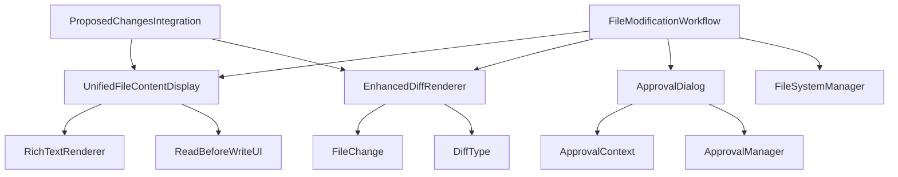

# Omnimancer Agent API Reference

This document provides a comprehensive API reference for the Omnimancer agent system components, including the approval flow, file operations, and UI components.

## Core Components Overview



## File Modification Workflow

### `FileModificationWorkflow`

Main orchestrator for file modification operations with user approval.

**Location**: `omnimancer/core/agent/file_modification_workflow.py`

#### Class Definition

```python
class FileModificationWorkflow:
    def __init__(
        self,
        file_system_manager: FileSystemManager,
        approval_manager: EnhancedApprovalManager,
        config: Optional[WorkflowConfig] = None
    )
```

#### Core Methods

##### `execute_single_file_workflow()`

Execute workflow for a single file operation.

```python
async def execute_single_file_workflow(
    self,
    file_path: str,
    operation_type: str,
    new_content: Optional[str] = None,
    operation_context: Optional[Dict[str, Any]] = None
) -> WorkflowContext
```

**Parameters**:
- `file_path` (str): Path to the target file
- `operation_type` (str): Type of operation ('create', 'modify', 'delete')
- `new_content` (Optional[str]): New content for create/modify operations
- `operation_context` (Optional[Dict]): Additional context for the operation

**Returns**: `WorkflowContext` containing operation results

**Example**:
```python
workflow = FileModificationWorkflow(file_manager, approval_manager)
result = await workflow.execute_single_file_workflow(
    file_path="/path/to/file.py",
    operation_type="create",
    new_content="print('Hello, World!')"
)

if result.final_result == WorkflowResult.APPROVED_AND_APPLIED:
    print("File created successfully!")
```

##### `execute_file_modification_workflow()`

Execute workflow for multiple file operations.

```python
async def execute_file_modification_workflow(
    self,
    operation_id: str,
    change_set: ChangeSet,
    operation_context: Optional[Dict[str, Any]] = None
) -> WorkflowContext
```

**Parameters**:
- `operation_id` (str): Unique identifier for the operation
- `change_set` (ChangeSet): Collection of proposed changes
- `operation_context` (Optional[Dict]): Additional context

**Returns**: `WorkflowContext` with batch operation results

#### State Management

##### `get_workflow_status()`

Get current status of a running workflow.

```python
async def get_workflow_status(self, operation_id: str) -> Optional[Dict[str, Any]]
```

##### `cancel_workflow()`

Cancel a running workflow.

```python
async def cancel_workflow(self, operation_id: str) -> bool
```

### `WorkflowContext`

Container for workflow state and results.

#### Attributes

```python
@dataclass
class WorkflowContext:
    operation_id: str
    operation_type: str
    initiated_by: str
    initiated_at: datetime
    metadata: Dict[str, Any]
    current_state: WorkflowState
    state_history: List[Dict[str, Any]]
    final_result: Optional[WorkflowResult]
    user_decisions: List[ApprovalDecision]
    applied_changes: List[str]
    failed_changes: List[str]
```

### `WorkflowConfig`

Configuration options for workflow behavior.

```python
@dataclass
class WorkflowConfig:
    approval_timeout_seconds: int = 300
    auto_apply_approved: bool = True
    batch_approval_threshold: int = 5
    save_workflow_history: bool = True
    show_risk_assessment: bool = True
    diff_type: DiffType = DiffType.UNIFIED
```

## File Content Display

### `UnifiedFileContentDisplay`

Unified interface for displaying file content and modifications.

**Location**: `omnimancer/core/agent/file_content_display.py`

#### Class Definition

```python
class UnifiedFileContentDisplay:
    def __init__(
        self,
        console: Optional[Console] = None,
        config: Optional[FileDisplayConfig] = None
    )
```

#### Display Methods

##### `display_file_creation()`

Display interface for new file creation.

```python
async def display_file_creation(
    self,
    file_path: str,
    content: str,
    operation_context: Optional[Dict[str, Any]] = None
) -> Dict[str, Any]
```

##### `display_file_modification()`

Display interface for file modification with diff.

```python
async def display_file_modification(
    self,
    file_path: str,
    current_content: str,
    new_content: str,
    operation_context: Optional[Dict[str, Any]] = None
) -> Dict[str, Any]
```

##### `display_file_deletion()`

Display interface for file deletion.

```python
async def display_file_deletion(
    self,
    file_path: str,
    content: str,
    operation_context: Optional[Dict[str, Any]] = None
) -> Dict[str, Any]
```

##### `display_batch_operations()`

Display interface for batch file operations.

```python
def display_batch_operations(
    self,
    operations: List[Dict[str, Any]],
    operation_context: Optional[Dict[str, Any]] = None
) -> Dict[str, Any]
```

### `FileDisplayConfig`

Configuration for file content display.

```python
@dataclass
class FileDisplayConfig:
    display_mode: DisplayMode = DisplayMode.FULL_CONTENT
    syntax_highlighting: bool = True
    show_line_numbers: bool = True
    max_preview_lines: int = 100
    max_content_size: int = 1024 * 1024  # 1MB
    truncate_large_files: bool = True
    diff_type: DiffType = DiffType.UNIFIED
    show_risk_assessment: bool = True
    show_file_stats: bool = True
```

## Diff Rendering

### `EnhancedDiffRenderer`

Advanced diff rendering with multiple view modes.

**Location**: `omnimancer/core/agent/diff_renderer.py`

#### Class Definition

```python
class EnhancedDiffRenderer:
    def __init__(
        self,
        console: Optional[Console] = None,
        config: Optional[DiffConfig] = None
    )
```

#### Core Methods

##### `render_file_change()`

Render a file change as a diff.

```python
def render_file_change(
    self,
    file_change: FileChange,
    diff_type: DiffType = DiffType.UNIFIED,
    show_line_numbers: bool = True,
    context_lines: int = 3
) -> str
```

##### `render_unified_diff()`

Generate unified diff format.

```python
def render_unified_diff(
    self,
    old_content: str,
    new_content: str,
    old_label: str = "original",
    new_label: str = "modified",
    context_lines: int = 3
) -> str
```

##### `render_side_by_side_diff()`

Generate side-by-side diff format.

```python
def render_side_by_side_diff(
    self,
    old_content: str,
    new_content: str,
    old_label: str = "original",
    new_label: str = "modified",
    width: int = 80
) -> str
```

### `FileChange`

Represents a file change for diff rendering.

```python
@dataclass
class FileChange:
    file_path: str
    change_type: FileChangeType
    old_content: Optional[str] = None
    new_content: Optional[str] = None
    language: Optional[str] = None
    encoding: str = 'utf-8'
    
    @property
    def lines_added(self) -> int
    
    @property
    def lines_removed(self) -> int
```

### `DiffType` Enum

Available diff rendering modes.

```python
class DiffType(Enum):
    UNIFIED = "unified"
    SIDE_BY_SIDE = "side_by_side"
    INLINE = "inline"
    CONTEXT = "context"
```

## Approval System

### `ApprovalDialog`

Interactive approval dialog for user decisions.

**Location**: `omnimancer/core/agent/approval_dialog.py`

#### Class Definition

```python
class ApprovalDialog:
    def __init__(
        self,
        renderer: RichTextRenderer,
        diff_renderer: EnhancedDiffRenderer,
        console: Optional[Console] = None,
        options: Optional[DialogOptions] = None
    )
```

#### Core Methods

##### `show_approval_dialog()`

Display approval dialog and capture user decision.

```python
async def show_approval_dialog(
    self,
    context: ApprovalContext,
    preview_data: Dict[str, Any]
) -> ApprovalDecision
```

##### `show_batch_approval_dialog()`

Display batch approval dialog for multiple operations.

```python
async def show_batch_approval_dialog(
    self,
    context: ApprovalContext,
    change_set: ChangeSet
) -> List[ApprovalDecision]
```

### `ApprovalContext`

Context for approval operations.

```python
@dataclass
class ApprovalContext:
    operation_id: str
    operation_type: OperationType
    file_path: str
    risk_level: RiskLevel
    user_id: Optional[str] = None
    metadata: Dict[str, Any] = field(default_factory=dict)
    created_at: datetime = field(default_factory=datetime.now)
```

### `ApprovalDecision`

User decision on an approval request.

```python
@dataclass
class ApprovalDecision:
    decision: ApprovalDecisionType
    remember: bool = False
    user_notes: str = ""
    response_time_seconds: float = 0.0
    timeout_occurred: bool = False
    created_at: datetime = field(default_factory=datetime.now)
```

## Proposed Changes Integration

### `ProposedChangesIntegration`

Integration module for displaying proposed changes.

**Location**: `omnimancer/core/agent/proposed_changes_integration.py`

#### Class Definition

```python
class ProposedChangesIntegration:
    def __init__(
        self,
        file_display: UnifiedFileContentDisplay,
        diff_renderer: EnhancedDiffRenderer,
        console: Optional[Console] = None
    )
```

#### Core Methods

##### `display_proposed_changes()`

Display proposed changes with visual distinctions.

```python
async def display_proposed_changes(
    self,
    change_set: ChangeSet,
    display_mode: ChangeDisplayMode = ChangeDisplayMode.UNIFIED
) -> Dict[str, Any]
```

##### `fetch_and_display_changes()`

Fetch changes from source and display them.

```python
async def fetch_and_display_changes(
    self,
    change_source: str,
    file_paths: List[str]
) -> Dict[str, Any]
```

### `ProposedChange`

Represents a proposed change to a file.

```python
@dataclass
class ProposedChange:
    file_path: str
    operation_type: ChangeType
    original_content: Optional[str] = None
    modified_content: Optional[str] = None
    metadata: Dict[str, Any] = field(default_factory=dict)
    risk_level: RiskLevel = RiskLevel.LOW
    change_summary: Optional[str] = None
    line_changes: Optional[Dict[str, Any]] = None
    timestamp: datetime = field(default_factory=datetime.now)
```

### `ChangeSet`

Collection of related proposed changes.

```python
@dataclass
class ChangeSet:
    id: str
    description: str
    changes: List[ProposedChange]
    total_risk_score: float = 0.0
    approved: bool = False
    applied: bool = False
    created_at: datetime = field(default_factory=datetime.now)
```

## Enums and Types

### Risk Assessment

```python
class RiskLevel(Enum):
    LOW = "low"
    MEDIUM = "medium" 
    HIGH = "high"
    CRITICAL = "critical"
```

### Operation Types

```python
class OperationType(Enum):
    READ = "read"
    WRITE = "write"
    CREATE = "create"
    DELETE = "delete"
    MOVE = "move"
    COPY = "copy"
    MODIFY = "modify"
```

### Workflow States

```python
class WorkflowState(Enum):
    INITIALIZED = "initialized"
    DISPLAYING_CHANGES = "displaying_changes"
    AWAITING_APPROVAL = "awaiting_approval"
    APPLYING_CHANGES = "applying_changes"
    COMPLETED = "completed"
    CANCELLED = "cancelled"
    ERROR = "error"
```

### Workflow Results

```python
class WorkflowResult(Enum):
    APPROVED_AND_APPLIED = "approved_and_applied"
    APPROVED_NOT_APPLIED = "approved_not_applied"
    DENIED = "denied"
    CANCELLED = "cancelled"
    ERROR = "error"
```

## Usage Examples

### Basic File Creation

```python
from omnimancer.core.agent import FileModificationWorkflow, FileSystemManager
from omnimancer.core.agent.approval_manager import EnhancedApprovalManager

# Initialize components
file_manager = FileSystemManager()
approval_manager = EnhancedApprovalManager()
workflow = FileModificationWorkflow(file_manager, approval_manager)

# Create a file
result = await workflow.execute_single_file_workflow(
    file_path="/home/user/hello.py",
    operation_type="create",
    new_content='print("Hello, World!")'
)

print(f"Result: {result.final_result}")
print(f"Applied changes: {result.applied_changes}")
```

### Batch Operations

```python
from omnimancer.core.agent.proposed_changes_integration import ProposedChange, ChangeSet

# Create proposed changes
changes = [
    ProposedChange(
        file_path="/project/main.py",
        operation_type=ChangeType.FILE_MODIFY,
        original_content="old content",
        modified_content="new content",
        risk_level=RiskLevel.LOW
    ),
    ProposedChange(
        file_path="/project/utils.py",
        operation_type=ChangeType.FILE_CREATE,
        modified_content="utility functions",
        risk_level=RiskLevel.LOW
    )
]

# Create change set
change_set = ChangeSet(
    id="batch-operation-1",
    description="Project refactoring",
    changes=changes
)

# Execute batch workflow
result = await workflow.execute_file_modification_workflow(
    operation_id="batch-op-1",
    change_set=change_set
)
```

### Custom Display Configuration

```python
from omnimancer.core.agent.file_content_display import FileDisplayConfig, DisplayMode

# Configure display options
config = FileDisplayConfig(
    display_mode=DisplayMode.DIFF,
    syntax_highlighting=True,
    show_line_numbers=True,
    max_preview_lines=50,
    diff_type=DiffType.SIDE_BY_SIDE,
    show_risk_assessment=True
)

# Create display instance
display = UnifiedFileContentDisplay(config=config)

# Display file modification
result = await display.display_file_modification(
    file_path="/project/config.py",
    current_content="old config",
    new_content="new config"
)
```

## Error Handling

### Common Exceptions

```python
from omnimancer.core.agent.exceptions import (
    WorkflowError,
    ApprovalTimeoutError,
    FileOperationError,
    ValidationError
)

try:
    result = await workflow.execute_single_file_workflow(
        file_path="/protected/file.py",
        operation_type="create",
        new_content="content"
    )
except ApprovalTimeoutError:
    print("User approval timed out")
except FileOperationError as e:
    print(f"File operation failed: {e}")
except WorkflowError as e:
    print(f"Workflow error: {e}")
```

### Error Recovery

```python
# Retry with different parameters
try:
    result = await workflow.execute_single_file_workflow(
        file_path="/tmp/safe_file.py",
        operation_type="create",
        new_content="content",
        operation_context={"retry_count": 1}
    )
except Exception as e:
    # Log error and provide fallback
    logger.error(f"Operation failed: {e}")
    # Implement fallback logic
```

## Testing

### Unit Testing

```python
import pytest
from unittest.mock import Mock, AsyncMock

@pytest.mark.asyncio
async def test_file_creation_workflow():
    # Mock dependencies
    file_manager = Mock()
    approval_manager = Mock()
    
    # Setup mocks
    approval_manager.request_approval = AsyncMock(return_value=ApprovalDecision(
        decision=ApprovalDecisionType.APPROVED
    ))
    file_manager.write_file = AsyncMock(return_value={"success": True})
    
    # Test workflow
    workflow = FileModificationWorkflow(file_manager, approval_manager)
    result = await workflow.execute_single_file_workflow(
        file_path="/test/file.py",
        operation_type="create",
        new_content="test content"
    )
    
    assert result.final_result == WorkflowResult.APPROVED_AND_APPLIED
    assert "/test/file.py" in result.applied_changes
```

### Integration Testing

```python
@pytest.mark.asyncio
async def test_approval_flow_integration():
    # Use real components for integration testing
    file_manager = FileSystemManager()
    approval_manager = EnhancedApprovalManager()
    workflow = FileModificationWorkflow(file_manager, approval_manager)
    
    # Test with mocked user input
    with patch('builtins.input', return_value='Y'):
        result = await workflow.execute_single_file_workflow(
            file_path="/tmp/test_file.py",
            operation_type="create",
            new_content="print('test')"
        )
    
    assert result.final_result == WorkflowResult.APPROVED_AND_APPLIED
```

---

**Note**: This API reference covers the core components of the Omnimancer agent system. For additional details, refer to the source code and inline documentation.