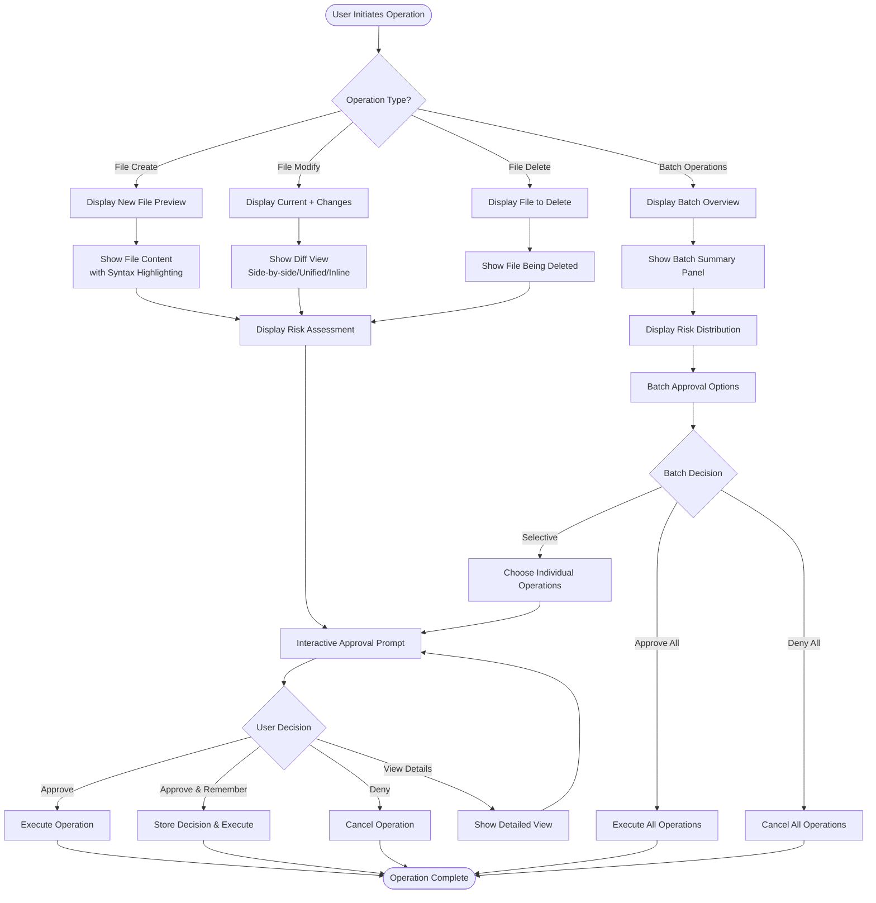

# File Modification Interaction Flow

## Overview
This document outlines the user interaction flow for file content display and modification approval in Omnimancer, leveraging existing UI components.

## Flow Diagram



## Interaction States

### 1. Initial Presentation
**Components Used:** `approval_dialog.py`, `approval_formatter.py`

- **Header Display**: Operation type, file path, timestamp
- **Risk Level Indicator**: Color-coded badge (green/yellow/red/critical)
- **Operation Context**: Brief description of what will happen

### 2. Content Display States

#### 2.1 New File Creation
**Components Used:** `read_before_write_ui.py`, `rich_renderer.py`

- Display full content with syntax highlighting
- Show file statistics (lines, size, encoding)
- Preview truncated if >2000 lines

#### 2.2 File Modification
**Components Used:** `diff_renderer.py`, `approval_dialog.py`

- **View Modes** (user-selectable):
  - Unified diff (default)
  - Side-by-side comparison
  - Inline changes
  - Context view (3 lines before/after)
- **Visual Indicators**:
  - Added lines: Green background
  - Removed lines: Red background
  - Modified lines: Yellow highlight
  - Line numbers displayed

#### 2.3 File Deletion
**Components Used:** `approval_formatter.py`, `read_before_write_ui.py`

- Show file content being deleted
- Display file metadata (size, last modified)
- Warning panel for permanent deletion

#### 2.4 Batch Operations
**Components Used:** `batch_approval_display.py`, `batch_operation_monitor.py`

- Overview panel with statistics
- Risk distribution chart
- Paginated list of operations
- Progress indicator for processing

### 3. User Interaction States

#### 3.1 Approval Prompt
**Components Used:** `approval_prompt.py`, `input_handler.py`

**Available Actions:**
- `Y` / `Enter` - Approve operation
- `N` / `Esc` - Deny operation
- `A` - Approve and remember (skip similar future prompts)
- `D` - View detailed diff/content
- `S` - Skip (batch mode only)
- `Q` - Quit/Cancel all
- `↑↓` - Navigate in batch mode
- `Space` - Toggle selection in batch mode

#### 3.2 Detailed View
**Components Used:** `approval_dialog.py`, `diff_renderer.py`

- Full file content or diff
- Scrollable interface
- Syntax highlighting maintained
- Return to decision prompt

### 4. Decision Processing

#### 4.1 Single Operation
**Components Used:** `approval_interface.py`, `approval_context.py`

**Flow:**
1. Capture user decision
2. Log decision with timestamp
3. Execute or cancel operation
4. Display result message

#### 4.2 Batch Operations
**Components Used:** `batch_approval_filters.py`, `batch_operation_monitor.py`

**Flow:**
1. Present batch options
2. Allow filtering by risk/type
3. Process approved operations
4. Show progress bar
5. Display summary of results

### 5. Feedback States

#### 5.1 Success
- Green checkmark icon
- Success message
- Operation details logged

#### 5.2 Denial
- Red X icon
- Cancellation message
- Reason logged if provided

#### 5.3 Error
- Error panel with details
- Suggested actions
- Option to retry

## Component Integration Map

```
┌─────────────────────────────────────────────────────────┐
│                    Main Entry Point                      │
│                 approval_interface.py                    │
└────────────────────┬────────────────────────────────────┘
                     │
        ┌────────────┴────────────┬─────────────────┐
        ▼                         ▼                 ▼
┌──────────────┐        ┌──────────────┐   ┌──────────────┐
│   Single Op  │        │   Batch Op   │   │ Read Before  │
│approval_dialog│        │batch_approval│   │ Write Flow   │
└──────┬───────┘        └──────┬───────┘   └──────┬───────┘
       │                        │                   │
       └────────────┬───────────┴───────────────────┘
                    ▼
        ┌───────────────────────────┐
        │    Content Rendering      │
        ├───────────────────────────┤
        │ • diff_renderer.py        │
        │ • rich_renderer.py        │
        │ • approval_formatter.py   │
        └───────────────────────────┘
                    │
                    ▼
        ┌───────────────────────────┐
        │    User Interaction       │
        ├───────────────────────────┤
        │ • approval_prompt.py      │
        │ • input_handler.py        │
        └───────────────────────────┘
                    │
                    ▼
        ┌───────────────────────────┐
        │    Decision Processing    │
        ├───────────────────────────┤
        │ • approval_context.py     │
        │ • file_system_manager.py  │
        └───────────────────────────┘
```

## User Experience Guidelines

### Visual Hierarchy
1. **Risk Level** - Most prominent (color + icon)
2. **Operation Type** - Clear header
3. **File Path** - Highlighted
4. **Content/Changes** - Main focus area
5. **Actions** - Clear, accessible buttons

### Color Scheme
- **Low Risk**: Green (#2ECC40)
- **Medium Risk**: Yellow (#FFDC00)
- **High Risk**: Orange (#FF851B)
- **Critical Risk**: Red (#FF4136)
- **Added Content**: Green background
- **Removed Content**: Red background
- **Modified Content**: Yellow highlight

### Keyboard Shortcuts
- Optimized for quick decisions
- Common actions on single keys
- Consistent across all approval types
- ESC always cancels/goes back

### Response Time
- Immediate visual feedback on keypress
- Progress indicators for operations >0.5s
- Timeout warnings at 30s, 60s
- Auto-timeout at 5 minutes with safe default (deny)

## Error Handling

### Network Errors
- Retry with exponential backoff
- Show user-friendly error message
- Offer manual retry option

### File Access Errors
- Clear permission error messages
- Suggest corrective actions
- Fall back to read-only display

### Validation Errors
- Highlight specific issues
- Provide correction suggestions
- Allow editing before retry

## Accessibility Considerations

- High contrast mode support
- Screen reader compatible text
- Keyboard-only navigation
- Clear focus indicators
- Descriptive error messages

## Testing Scenarios

1. **Single File Operations**
   - Create new file
   - Modify existing file
   - Delete file
   - Large file handling (>1MB)

2. **Batch Operations**
   - Mixed operation types
   - Risk level filtering
   - Selective approval
   - Progress monitoring

3. **Edge Cases**
   - Binary files
   - Empty files
   - Permission denied
   - Network timeout
   - User cancellation

## Implementation Notes

- All components already exist and are tested
- Integration focuses on proper data flow
- Maintain existing error handling patterns
- Preserve current logging infrastructure
- Use existing configuration system

## Future Enhancements

- [ ] Undo/Redo capability
- [ ] Diff algorithm selection
- [ ] Custom risk thresholds
- [ ] Approval history viewer
- [ ] Template-based auto-approval